# check_mk_to_securecrt_export
Export Check_MK hosts to SecureCRT Session Manager

This script exports over an Check_MK View hosts and imports them in SecureCRT Session Manager.

The bundled python of SecureCRT not support urllib / urllib2 (see https://forums.vandyke.com/showthread.php?t=13127).
I don`t want to modify the bundled python version of SecureCRT, so i have decided to put the code in an extra binary.
The advantage is that you can deploy the binary to every client without install python
on every client. You can encrypt the source code (that is NOT 100% safe) so the credentials stored in the helper are not visable.

Sessions will be imported in the Folder _Check_MK_Imports. Existing Sessions will be overwirtten in the folder.
Note: If a host is removed in Check_MK it will not be removed in SecureCRT. This is a feature improvement, for the moment simple delete the _Check_MK_Imports folder and sync it again.


## Requirements
- Installed python 3.8 with pyinstaller and tinyaes installed.
- Automation User on Check_MK instance
- Extra view in Check_MK with the hosts to export to SecureCRT

## Install python requirements on dev machine
```
pip install pyinstaller[encryption] tinyaes
```

## Create automation user in Check_MK
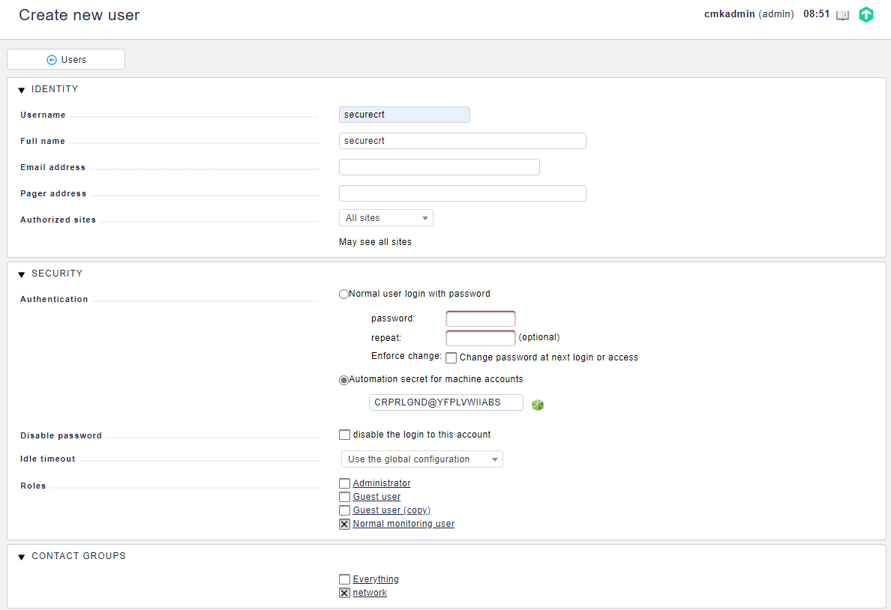
- Create user as normal monitoring user with automation secret

## Create view in Check_MK
Go to edit views

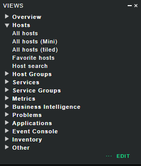

Clone allhosts view, click on the copy symbol.


Modify name of the view, hide the view from sidebar and make it available for all.

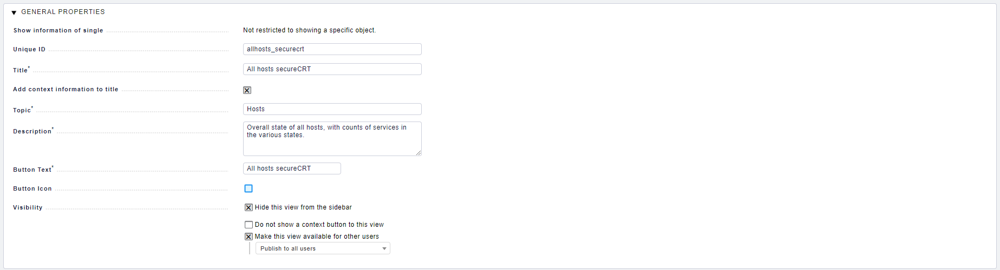

Modify the view that only 3 colums are present. Remove sorting and grouping, it is not required.

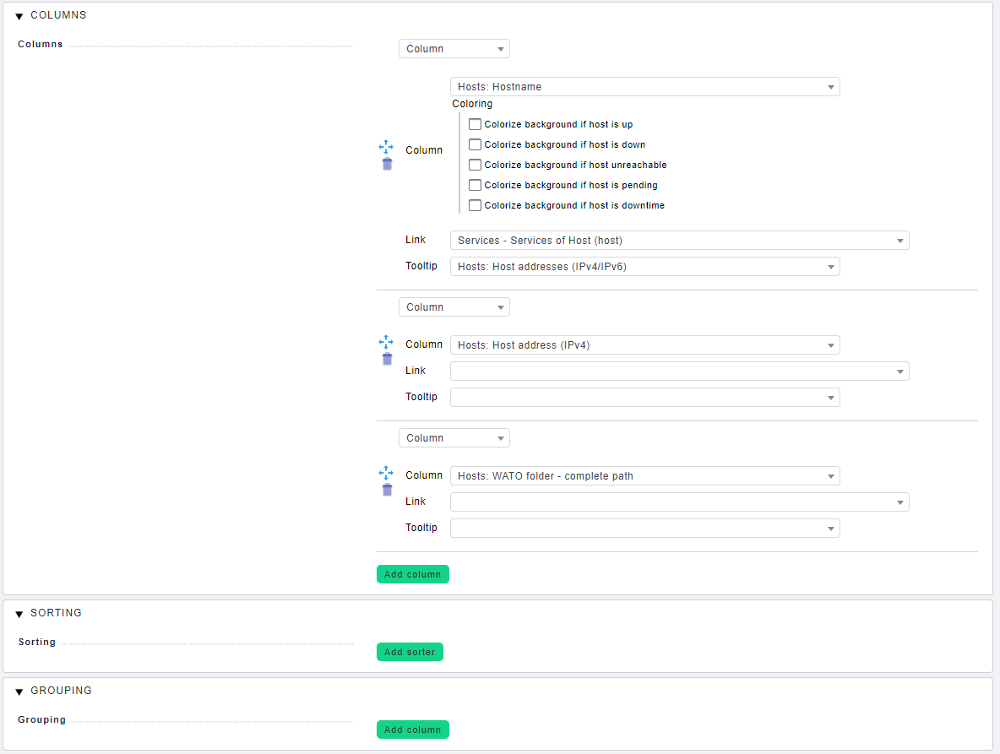

You can apply custom filtering for the view if you want e.g. filter on a special hostgroup.

## Test the view

You can try to access the view with your securecrt automation user in every browser, the response should be json content.

```
https://<check_mk host>/<check_mk instance>/check_mk/view.py?view_name=<view name>&output_format=json&_username=<securecrt automation user>&_secret=<password>
```

Example resonse
```
[
 [
  "host", 
  "host_ipv4_address", 
  "wato_folder_abs"
 ], 
 [
  "router", 
  "2.2.2.2", 
  "Main directory / network"
 ], 
 [
  "lalala", 
  "1.2.3.4", 
  "Main directory / network"
 ], 
 [
  "lololo", 
  "2.3.4.5", 
  "Main directory / network / test"
 ], 
 [
  "linux", 
  "1.2.3.6", 
  "Main directory / network"
 ]
]
```

## Modify sourcecode of the helper
Add the correct URL and credentials in the file.

```
########################################################################################################################
# Settings

# User to interact with check_mk, user need automation secret!
user = "securecrt"

# Automation secret
secret = "OYPCCOJCCMDPQSCLYFOI"

# URL to check_mk instance with ? at the end
url = "https://checkmk.company.local/core/check_mk/view.py?"

# View which shows prefiltered the hosts you want to create sessions in check_mk
# Only tree columns are allowed in the view:
# hostname,ip,wato_folder_abs
# See details on https://github.com/lanbugs/check_mk_to_securecrt_export or https://lanbugs.de
# You can test it manually if you browse the url in an browser.
# e.g. https://checkmk.company.corp/central_mon/check_mk/view.py?view_name=allhosts_securecrt&_username=securecrt&_secret=OYPCCOJCCMDPQSCLYFOI&output_format=json
# You should see an json output with the 3 columns.
view_name = "allhosts_securecrt"
```

## Build the helper binary

### Without encryption

```
c:\Python38\python.exe -OO -m PyInstaller -D check_mk_to_securecrt_export_helper.py
```

### With encryption
Define an 16 char encryption key like 0123456789ABCDEF (not safe!) 
```
c:\Python38\python.exe -OO -m PyInstaller --key=0123456789ABCDEF -D check_mk_to_securecrt_export_helper.py
```

## Deploy files
Create a folder like c:\securecrt_scripts

1. Copy the dist folder to c:\securecrt_scripts
2. Copy the check_mk_to_securecrt_export.py to c:\securecrt_scripts

## Use it!

### Run it once ...
Goto Script > Run ...

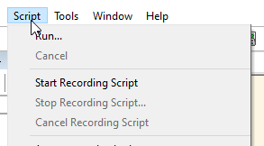

Select check_mk_to_securecrt_export.py

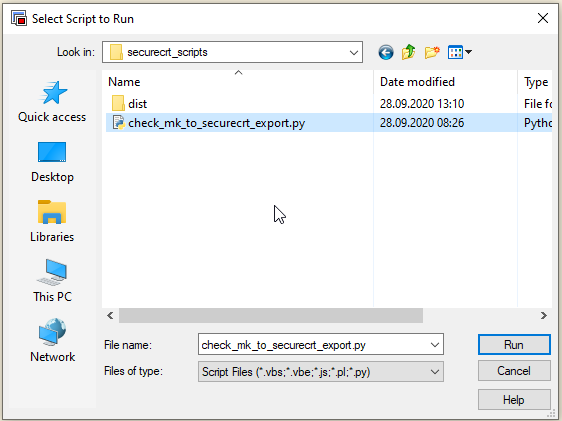

Run it :-)

### Add button to button bar
Enable the button bar.

View > Button Bar

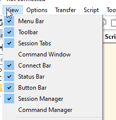

On the bottom of SecureCRT you can see now the button bar. Right click on the bar and click "New Button..."

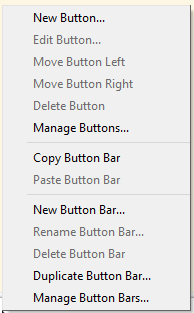

Select in the dropdown Function "Run Script"

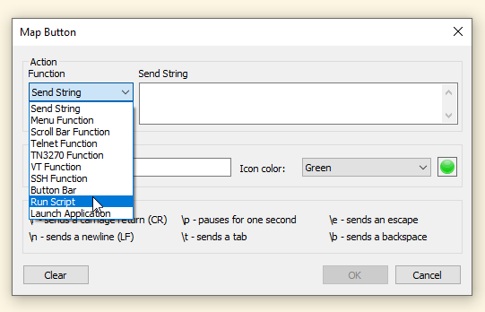

Choose in "Run Script" the check_mk_to_securecrt_export.py, in Arguments you can add your username, every session will be created with thhis username.

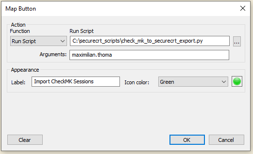

Finished :-)

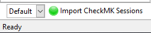

## Finally

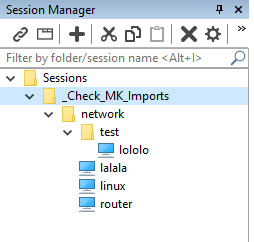

Have fun :-)

## Known bugs

- Sometimes you must sync twice that all sessions are created, this is under investigation.